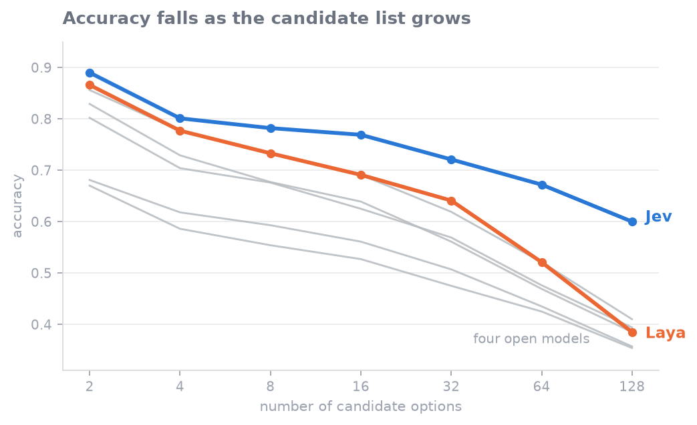
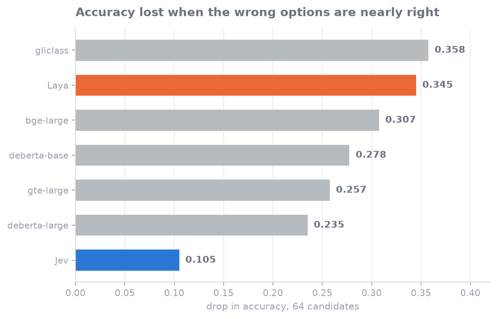
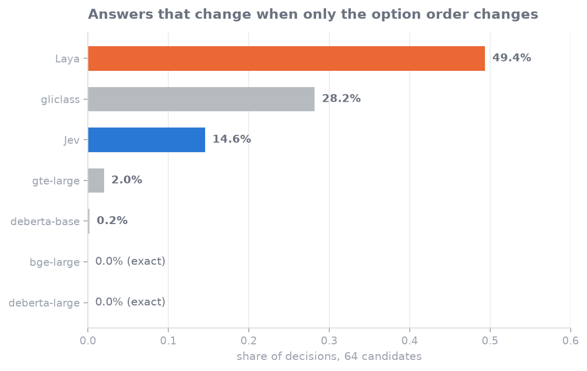

# Decision Models Under Pressure

A comparison of seven systems that take a piece of text, a question, and a list of
candidate answers, and return a probability over those candidates. Two of them are
the products this was really about: TypeSafe's [Jev](https://typesafe.ai/blog/introducing-system-one-models-and-jev),
which its makers call a new class of model, and Convai's
[Laya](https://huggingface.co/convaiinnovations/laya), whose author says he
published the same idea a year earlier and that Jev is marketing on top of it.

The other five are open models, and they are here to give those two numbers
something to mean. How a model reads its candidates turns out to predict a lot, so
they are grouped that way:

| model | how it reads the candidates |
| --- | --- |
| `gliclass-large-v3.0` | all candidates in one pass, as a set, like Laya |
| `deberta-v3-base-zeroshot-v2.0` | one pass per candidate, each scored against the text alone |
| `deberta-v3-large-zeroshot-v2.0` | the same, larger |
| `bge-large-en-v1.5` | embeds the text once, compares it to cached candidate vectors |
| `thenlper/gte-large` | the same, different encoder |

Only `gliclass` and Laya can see the candidates as a set. The other four score each
one in isolation, which means they are incapable of noticing that two candidates
are similar, and equally incapable of being swayed by the order you list them in.
That distinction runs through all three results below.

Published comparisons of these systems usually report one accuracy number on one
candidate-set size. That turns out to hide most of what matters. The ranking of these
models changes depending on how many options you offer, so I varied the three
things a real deployment varies: how long the candidate list is, what order it is
in, and how plausible the wrong answers are.

Everything here was measured on one frozen dataset, with the contrasts and
decision rules written down before the first call.

## What came out of it

Every model gets worse as the candidate list grows. The difference is how fast.



Jev starts highest and stays highest. At 128 candidates it answers 60% correctly
where Laya manages 39% and the best open model 41%. Its decline per doubling of the
list is the shallowest in the study, shallower even than the embedding scorers whose
design is supposed to make them scale gracefully.

The chart stops at 128 candidates because Jev's API refuses more than 255 options,
and a comparison is only worth reading where every model has data.

Notice how little a single-number benchmark would tell you. At two candidates Laya
sits second of seven, beating five of the six systems it is measured against, and
trails Jev by two points. At 128 it has fallen to fourth and trails Jev by
twenty-two.

Next the wrong answers had to get harder. Every item has two versions: one
where the distractors came from unrelated domains, and one where they were the
right answer's nearest neighbours, so `create alarm` competed against
`delete alarm` and `snooze alarm` rather than against `musical work`. The surface
shape of the words was matched between the two versions, so only meaning
separated them. The gap between the two is how much a model was relying on the
wrong answers being obvious.



Jev loses about a tenth of its accuracy. Laya loses over a third. This is the
widest separation in the study and the one that matters most in production, where
candidate sets are full of near misses.

Then the options got shuffled. Same question, same candidates, five different
orderings.



Two of the four open models never flip. Not rarely, never, because they score each
option in isolation and order cannot reach them. Against that baseline Jev's 14.6%
is a real cost: roughly one decision in seven is settled by list position rather
than by content. It is also three and a half times better than Laya, which changes
its answer on nearly half of its decisions at the same list size.

The flips are not spread evenly. Jev is steadiest on request routing and intent,
where it flips on 1.5% to 3% of items, and shakiest on emotional tone, where it
flips on about a third. If you are routing support tickets this barely touches
you. If you are scoring anything subjective it matters a lot.

Two fixes are available to anyone deploying these systems today. Present the
options in a fixed canonical order so the instability is at least deterministic, or
ask the same question under several orderings and average the results, which buys
exact stability at the price of several calls per decision.

This is the result the four open models exist in this study to frame. Reading the
candidates as a set is what lets a model weigh them against each other, and it is
also what lets their order leak into the answer. The models that cannot do the
first are immune to the second.

## What this cannot tell you

Jev's training data is not disclosed. The test items come from public datasets, so
"trained better" and "has seen these before" cannot be told apart here. The one
hint available points both ways: Jev is steadiest on exactly the intent-style domains a
decision product would most plausibly be trained on, and least steady on the one
domain furthest from that. Nothing in these results settles it, and no outside
evaluation can settle it while the training data stays private.

Three smaller limits. Jev rounds its probabilities to two decimals, which is too
coarse for calibration analysis, so this reports what it chose rather than how well
calibrated it was. Its API caps candidate lists at 255 options, so every model stops
at 128 here; the open models go further in the logs. And the near-distractor comparison rests on two domains,
both of which every model in the study has plausibly seen.

## Reproducing it

```bash
python -m venv .venv
.venv/bin/pip install torch transformers datasets sentence-transformers scikit-learn

.venv/bin/python -m harness.rebuild_texts       # restore item texts, see Data below
.venv/bin/python -m harness.run_v3 --rq rq3     # run one research question
.venv/bin/python -m harness.analyze_rq3
```

To rebuild the dataset from scratch rather than using the published freeze:

```bash
.venv/bin/python -m harness.build_v3 --n 200    # build and run the gates
.venv/bin/python -m harness.export_dataset
```

The Jev arm costs about a dollar for the full grid of 29,600 calls:

```bash
export OPENROUTER_API_KEY=sk-or-...
.venv/bin/python -m harness.run_jev --rq rq3 --cap 2.00
```

## Data

The published dataset carries every label, distractor list and derived field, but
no item text. The five upstream sources have incompatible terms and one of them is
tweet text with no stated licence, so redistributing the texts is not ours to do.
Each item instead carries a SHA-256 of its original text.
`harness.rebuild_texts` pulls the texts from the original sources and checks every
one against its published hash, so you get the exact items this study used without
anything encumbered being republished.

Sources: CLINC-150 (CC BY 3.0), GoEmotions (Apache 2.0), MTOP (CC BY-SA 4.0),
DBpedia Classes (CC BY-SA), twitter-financial-news-topic (no stated licence).

## What is in here

| path | contents |
| --- | --- |
| `dataset/v3-public/` | 1,000 items, the 902-option label universe, per-question splits, gate results, datacard |
| `harness/` | the pipeline: universe construction, item and pool building, the gates, model adapters, runners, analyses |
| `PREREGISTRATION.md` | the contrasts and decision rules, fixed before any model ran |
| `EXPERIMENTS.md` | every run, including the results that went against expectation |
| `docs/history/` | the audit that forced a rebuild of the dataset, and the deviations log |
| `archive/pre-v3/` | superseded code, kept so the earlier claims can be traced |

## How the dataset was validated

An earlier version of this study produced confident results that did not survive
review. Three independent audits found that a classifier with no access to the
item text could identify the right answer from label formatting alone, that an
option's position was a function of its label rather than the item, and that one
model's apparent context ceiling was an artifact of how this harness passed options
to it.

The dataset was rebuilt around those failures, and the checks that caught them now
run as assertions before any model does. Eight of them: no option string may
appear in the prompt's own wording, surface features must not separate near
distractors from far ones, a text-blind classifier must not find the gold above
chance, gold position must depend on the item, the near tier must be measurably
nearer, every item must be usable in both tiers at every list size, no adjudicated
ambiguous pair may sit together, and each option set must be well formed.

Seven of the eight pass. The one that does not is the text-blind classifier, which
still finds the right answer above chance on some cells, worst on DBpedia. The
per-cell numbers are published in `dataset/v3-public/gates.json` rather than
described away. Two fixes were tried and rejected, with their numbers
recorded: coarser matching reopens the formatting gate, and dropping the affected
items shrinks the sample while making the residual worse.

Two pre-registered rules fired against expectation during the study. One
voided a family-level comparison when the two models inside a family disagreed
more than the families did. The other required that the order-invariant models
score exactly zero, which they did, with the only exceptions traced to exact
scoring ties broken by position.

## Licence

MIT for the code. The datasets keep their own terms, listed above and in
`LICENSE`.
